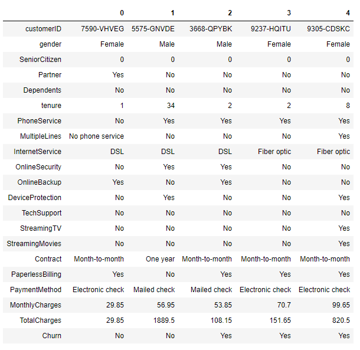
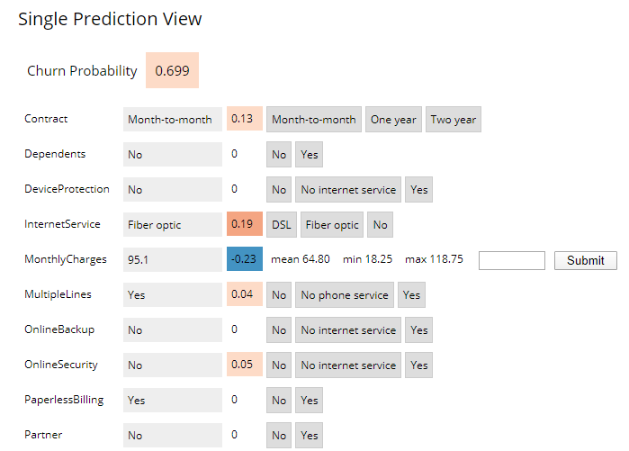
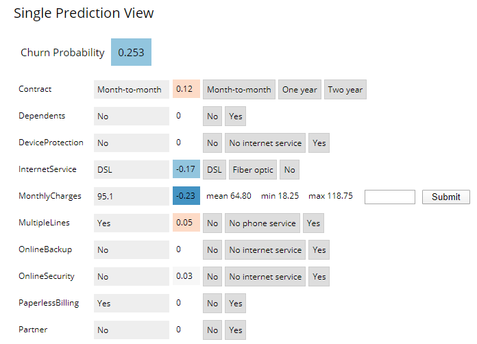

# Churn Prediction Project Template
This project is a Cloudera Machine Learning 
([CML](https://www.cloudera.com/products/machine-learning.html)) **Applied Machine Learning 
Project Template**. It has all the code and data needed to deploy an end-to-end machine 
learning project in a running CML instance.

## Project Overview
This project builds the telco churn with model interpretability project discussed in more 
detail [this blog post](https://blog.cloudera.com/visual-model-interpretability-for-telco-churn-in-cloudera-data-science-workbench/). 
The initial idea and code comes from the FFL Interpretability report which is now freely 
available and you can read the full report [here](https://ff06-2020.fastforwardlabs.com/)


The goal is to build a classifier model using Logistic Regression to predict the churn 
probability for a group of customers from a telecoms company. On top that, the model 
can then be interpreted using [LIME](https://github.com/marcotcr/lime). Both the Logistic 
Regression and LIME models are then deployed using CML's real-time model deployment 
capability and finally a basic flask based web application is deployed that will let 
you interact with the real-time model to see which factors in the data have the most 
influence on the churn probability.

### Initialize the Project
There are a couple of steps needed at the start to configure the Project and Workspace 
settings so each step will run sucessfully. You **must** run the project bootstrap 
before running other steps. If you just want to launch the model interpretability 
application without going through each step manually, then you can also deploy the 
complete project. 

***Project bootstrap***

Open the file `0_bootstrap.py` in a normal workbench python3 session. You only need a 
1 vCPU / 2 GiB instance. Once the session is loaded, click **Run > Run All Lines**. 
This will file will create an Environment Variable for the project called **STORAGE**, 
which is the root of default file storage location for the Hive Metastore in the 
DataLake (e.g. `s3a://my-default-bucket`). It will also upload the data used in the 
project to `$STORAGE/datalake/data/churn/`. The original file comes as part of this 
git repo in the `raw` folder.
  
***Deploy the Complete Project***

If you just wish build the project artifacts without going through each step manually, 
run the `7_build_projet.py` file in a python3 session. Again a 1 vCPU / 2 GiB instance 
will be suffient. This script will: 
* run the bootstrap
* then create the Hive Table and import the data
* deploy the model
* update the application files to use this new model
* deploy the application
Once the script has completed you will see the new model and application are now available 
in the project.

## Project Build
If you want go through each of the steps manually to build and understand how the project 
works, follow the steps below. There is a lot more detail and explanation/comments in each 
of the files/notebooks so its worth looking into those. Follow the steps below and you 
will end up with a running application.

### 0 Bootstrap
Just to reiterate that you have run the bootstrap for this project before anything else. 
So make sure you run step 0 first. 

Open the file `0_bootstrap.py` in a normal workbench python3 session. You only need a 
1 CPU / 2 GB instance. Then **Run > Run All Lines**

### 1 Ingest Data
This script will read in the data csv from the file uploaded to the s3 bucket setup 
during the bootstrap and create a managed table in Hive. This is all done using Spark.

Open `1_data_ingest.py` in a Workbench session: python3, 1 CPU, 2 GB. Run the file.

### 2 Explore Data
This is a Jupyter Notebook that does some basic data exploration and visualistaion. It 
is to show how this would be part of the data science workflow.



Open a Jupyter Notebook session (rather than a work bench): python3, 1 CPU, 2 GB and 
open the `2_data_exploration.ipynb` file. 

At the top of the page click **Cells > Run All**.

### 3 Model Building
This is also a Jupyter Notebook to show the process of selecting and building the model 
to predict churn. It also shows more details on how the LIME model is created and a bit 
more on what LIME is actually doing.

Open a Jupyter Notebook session (rather than a work bench): python3, 1 CPU, 2 GB and 
open the `	3_model_building.ipynb` file. 

At the top of the page click **Cells > Run All**.

### 4 Model Training
A model pre-trained is saved with the repo has been and placed in the `models` directory. 
If you want to retrain the model, open the `4_train_models.py` file in a workbench  session: 
python3 1 vCPU, 2 GiB and run the file. The newly model will be saved in the models directory 
named `telco_linear`. 

There are 2 other ways of running the model training process

***1. Jobs***

The **[Jobs](https://docs.cloudera.com/machine-learning/cloud/jobs-pipelines/topics/ml-creating-a-job.html)**
feature allows for adhoc, recurring and depend jobs to run specific scripts. To run this model 
training process as a job, create a new job by going to the Project window and clicking _Jobs >
New Job_ and entering the following settings:
* **Name** : Train Mdoel
* **Script** : 4_train_models.py
* **Arguments** : _Leave blank_
* **Kernel** : Python 3
* **Schedule** : Manual
* **Engine Profile** : 1 vCPU / 2 GiB
The rest can be left as is. Once the job has been created, click **Run** to start a manual 
run for that job.

***2. Experiments***

The other option is running an **[Experiment](https://docs.cloudera.com/machine-learning/cloud/experiments/topics/ml-running-an-experiment.html)**. Experiments run immediately and are used for testing different parameters in a model training process. In this instance it would be use for hyperparameter optimisation. To run an experiment, from the Project window click Experiments > Run Experiment with the following settings.
* **Script** : 4_train_models.py
* **Arguments** : 0 lbfgs 100 _(these the cv, solver and max_iter parameters to be passed to 
LogisticRegressionCV() function)
* **Kernel** : Python 3
* **Engine Profile** : 1 vCPU / 2 GiB

Click **Start Run** and the expriment will be sheduled to build and run. Once the Run is 
completed you can view the outputs that are tracked with the experiment using the 
`cdsw.track_metrics` function. It's worth reading through the code to get a sense of what 
all is going on.


### 5 Serve Model
The **[Models](https://docs.cloudera.com/machine-learning/cloud/models/topics/ml-creating-and-deploying-a-model.html)** 
is used top deploy a machine learning model into production for real-time prediction. To 
deploy the model trailed in the previous step, from  to the Project page, click **Models > New
Model** and create a new model with the following details:

* **Name**: Explainer
* **Description**: Explain customer churn prediction
* **File**: 5_model_serve_explainer.py
* **Function**: explain
* **Input**: 
```
{
	"StreamingTV": "No",
	"MonthlyCharges": 70.35,
	"PhoneService": "No",
	"PaperlessBilling": "No",
	"Partner": "No",
	"OnlineBackup": "No",
	"gender": "Female",
	"Contract": "Month-to-month",
	"TotalCharges": 1397.475,
	"StreamingMovies": "No",
	"DeviceProtection": "No",
	"PaymentMethod": "Bank transfer (automatic)",
	"tenure": 29,
	"Dependents": "No",
	"OnlineSecurity": "No",
	"MultipleLines": "No",
	"InternetService": "DSL",
	"SeniorCitizen": "No",
	"TechSupport": "No"
}
```
* **Kernel**: Python 3
* **Engine Profile**: 1vCPU / 2 GiB Memory

Leave the rest unchanged. Click **Deploy Model** and the model will go through the build 
process and deploy a REST endpoint. Once the model is deployed, you can test it is working 
from the model Model Overview page.


### 6 Deploy Application
The final step is to deploy the Flask application. The **[Applications](https://docs.cloudera.com/machine-learning/cloud/applications/topics/ml-applications.html)** feature is still quite new for CML. For this project it is used to deploy a web based application that interacts with the underlying model created in the previous step.

_**Note: This next step is important**_

_In the deployed model from step 5, go to **Model > Settings** and make a note (i.e. copy) the 
"Access Key". It will look something like this (ie. mukd9sit7tacnfq2phhn3whc4unq1f38)_

_From the Project level click on "Open Workbench" (note you don't actually have to Launch a 
session) in order to edit a file. Select the flask/single_view.html file and paste the Access 
Key in at line 19._

`        const accessKey = "mp3ebluylxh4yn5h9xurh1r0430y76ca";`

_Save the file (if it has not auto saved already) and go back to the Project._

From the Go to the **Applications** section and select "New Application" with the following:
* **Name**: Churn Analysis App
* **Subdomain**: churn-app _(note: this needs to be unique, so if you've done this before, 
pick a more random subdomain name)_
* **Script**: 5_application.py
* **Kernel**: Python 3
* **Engine Profile**: 1vCPU / 2 GiB Memory


After the Application deploys, click on the blue-arrow next to the name. The initial view is a 
table of randomly selected from the dataset. This shows a global view of which features are 
most important for the predictor model. The reds show incresed importance for preditcting a 
cusomter that will churn and the blues for for customers that will not.


Clicking on any single row will show a "local" interpreted model for that particular data point 
instance. Here you can see how adjusting any one of the features will change the instance's 
churn prediction.




Changing the InternetService to DSL lowers the probablity of churn. *Note: this does not mean 
that changing the Internet Service to DSL cause the probability to go down, this is just what 
the model would predict for a customer with those data points*





